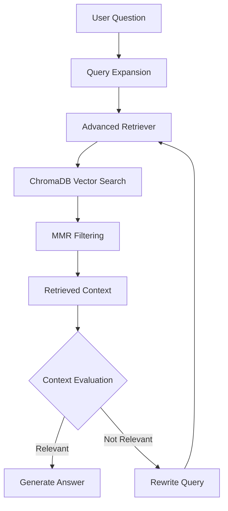
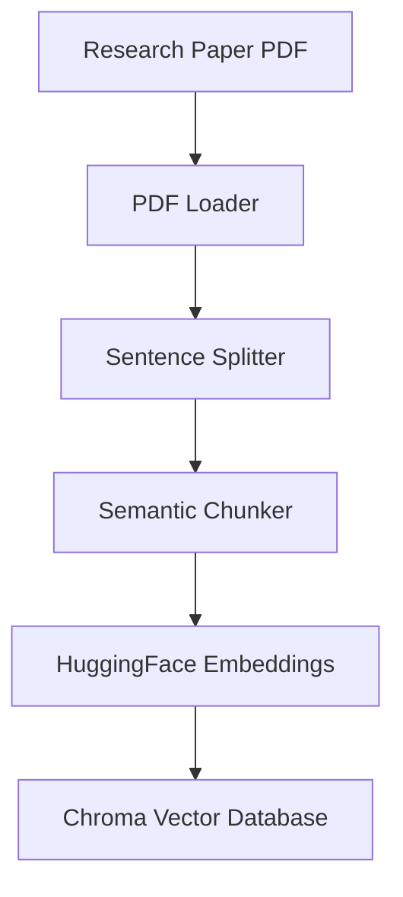
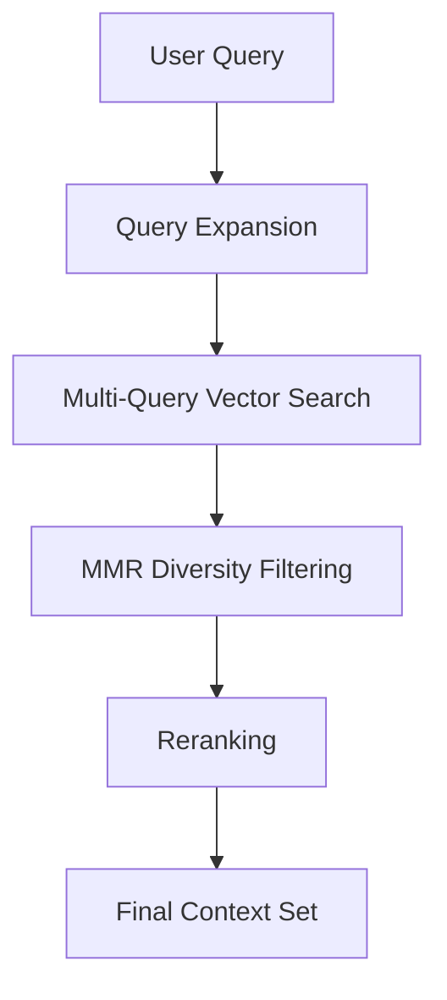
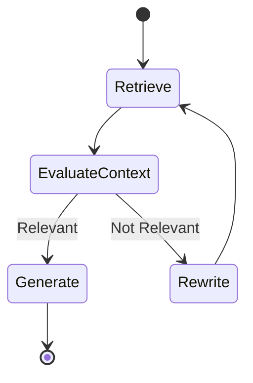

# 🧠 AI Research Agent

**An advanced, agentic RAG system for intelligent research paper analysis and question answering.**

Built on a self-correcting retrieval loop — the agent evaluates its own retrieved context, rewrites queries when evidence is weak, and only generates an answer once it's confident the context actually supports it.


---

## ✨ Features

- 🔍 **Query Expansion** — broadens the original question into multiple semantically related queries for better retrieval coverage
- 📚 **Semantic Chunking** — splits documents by meaning, not arbitrary character counts
- 🧩 **MMR Retrieval** — Maximal Marginal Relevance balances relevance and diversity in retrieved chunks
- 🔁 **Self-Correcting Agent Loop** — evaluates context quality and rewrites the query if retrieval is insufficient
- 🧠 **RAG-based Answer Generation** — grounded, context-aware responses via Groq LLM
- 🗂️ **Persistent Vector Storage** — ChromaDB-backed embeddings with metadata
- ⚙️ **Modular Architecture** — clean separation between ingestion, retrieval, agent, and API layers

---

## 🏗️ Architecture Overview

The system has two core pipelines: a **document ingestion pipeline** that prepares research papers for retrieval, and an **agentic query pipeline** that answers user questions using a self-correcting LangGraph loop.



---

## 📥 Data Ingestion Pipeline

Research papers are parsed, semantically chunked, embedded, and persisted to the vector store.



**Semantic Chunker**
- Splits documents intelligently based on semantic boundaries rather than fixed character windows
- Maintains token limits so chunks stay within embedding/model constraints
- Preserves semantic meaning across chunk boundaries, reducing context fragmentation

**Embedding Layer**
- Uses `BAAI/bge-base-en-v1.5` from HuggingFace
- Converts text chunks into dense vector representations for similarity search

**Vector Database**
- Uses ChromaDB as the persistent vector store
- Stores embeddings alongside document metadata (source, page, chunk index)

---

## 🔎 Retrieval Pipeline



**Retrieval System**
- **Query expansion** generates related query variants to improve search coverage and recall
- **MMR (Maximal Marginal Relevance)** improves diversity, avoiding redundant, near-duplicate chunks
- **Reranking** improves relevance ordering so the most useful chunks surface first

---

## 🤖 LangGraph Agent Workflow

The agent is modeled as a state machine: it retrieves, evaluates its own context, and loops back to rewrite the query if the evidence is insufficient — rather than blindly generating an answer.



**Agent**
- Implemented as a LangGraph state machine with explicit nodes and conditional edges
- Evaluates retrieved context for relevance before allowing generation
- Rewrites the query and re-retrieves when context is deemed insufficient
- Generates the final, grounded answer once context passes evaluation

---

## 📁 Project Structure

```
app/
│
├── ingestion/       # PDF loading, sentence splitting, semantic chunking
├── embeddings/       # HuggingFace embedding layer
├── vectorstore/      # ChromaDB client and persistence logic
├── retrieval/        # Query expansion, MMR, reranking
├── graph/             # LangGraph state machine (nodes, edges, state)
├── prompts/           # Prompt templates for each agent step
├── services/          # Business logic orchestrating pipelines
├── api/               # API route definitions
├── main.py            # Application entry point
└── config.py          # Environment and app configuration
```

---

## 🛠️ Technology Stack

| Component         | Technology   |
|--------------------|-------------|
| Agent Framework    | LangGraph   |
| LLM                | Groq        |
| Embeddings         | HuggingFace |
| Vector Database    | ChromaDB    |
| Backend            | FastAPI     |
| Frontend           | React       |
| Language           | Python      |

---

## ⚙️ Installation

**1. Clone the repository**
```bash
git clone https://github.com/<your-username>/ai-research-agent.git
cd ai-research-agent
```

**2. Create a virtual environment**
```bash
python -m venv .venv
source .venv/bin/activate      # macOS/Linux
.venv\Scripts\activate         # Windows
```

**3. Install dependencies**
```bash
pip install -r requirements.txt
```

---

## 🔐 Environment Variables

Create a `.env` file in the project root:

```env
# LLM Provider
GROQ_API_KEY=your_groq_api_key

# Embeddings
HUGGINGFACE_API_KEY=your_huggingface_api_key
EMBEDDING_MODEL=BAAI/bge-base-en-v1.5

# Vector Database
CHROMA_PERSIST_DIR=./chroma_db

# App Config
APP_ENV=development
LOG_LEVEL=INFO
```

---

## ▶️ Running the Application

**Ingest documents**
```bash
python -m app.ingestion.run --path ./data/papers
```

**Start the application**
```bash
python app/main.py
```

**(Optional) Run as an API server**
```bash
uvicorn app.api.main:app --reload
```

---

## 💡 Example Usage

```python
from app.services.research_agent import ResearchAgent

agent = ResearchAgent()

response = agent.ask(
    "What are the key contributions of this paper's proposed attention mechanism?"
)

print(response.answer)
print(response.sources)
```

**Sample output**
```
Answer: The paper introduces a sparse attention mechanism that reduces
computational complexity from O(n²) to O(n log n) while preserving...

Sources:
 - paper.pdf, page 4, chunk 12
 - paper.pdf, page 5, chunk 15
```

---

## 🗺️ Future Roadmap

- [ ] **FastAPI backend** — expose the agent via a production REST API
- [ ] **React frontend** — interactive chat UI for research exploration
- [ ] **Streaming responses** — token-level streaming for faster perceived latency
- [ ] **RAGAS evaluation** — automated retrieval/generation quality metrics
- [ ] **Authentication** — user accounts and API key management
- [ ] **Cloud deployment** — containerized deployment (Docker + cloud hosting)

---

## 📄 License

This project is licensed under the MIT License.